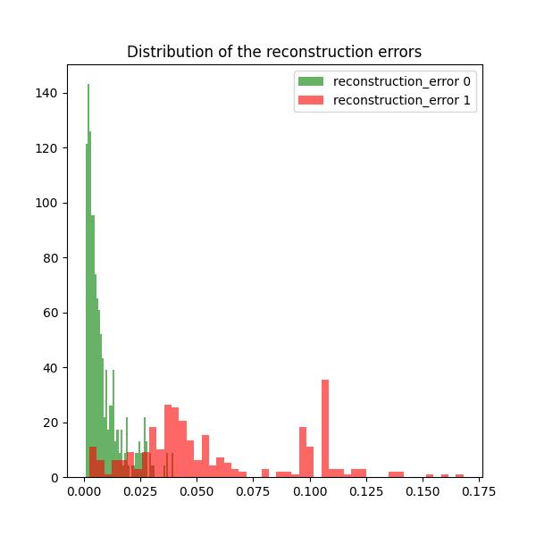
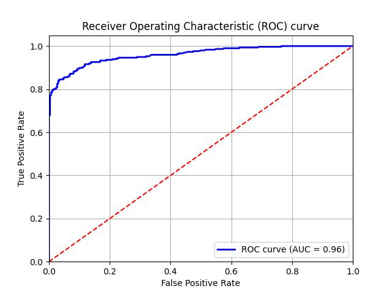
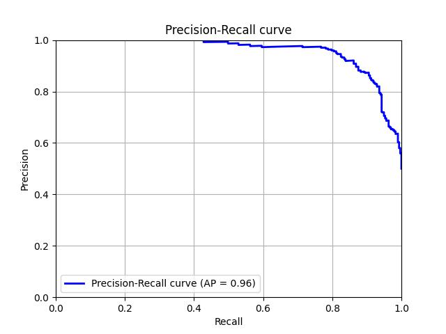

# Airbus Helicopter Accelerometer

## Installation

### Environment

Create the env:

```bash
cd <PATH_TO_airbus>
mkvirtualenv airbus -p python3.11
python -m pip install --upgrade pip
pip install -r requirements.txt
```

### Dataset generation
``` bash
cd data
./process.py --dir_out <dir_out> ...
```

### Training the model in the train set (no anomalous samples)

To reproduce results:

0. Tmux Session
``` bash
tmux a -t train   # or tmux new -s train
```

1. Set PYTHONPATH and GPUs
``` bash
export PYTHONPATH=.
export CUDA_VISIBLE_DEVICES=0,1
```

2. Run the training script `cli/a1_train.py` using the provided configuration file. Execute the following command:
``` bash
./cli/a1_train.py <cfg_fn> <encoder_name> <augmenation_degree>
./cli/a1_train.py cfg/train-adam-var.yaml autoencoder_v1 0.1
```

### Evaluate the model in the validation set
Run the training script `cli/a2_eval.py` using the provided configuration file. Execute the following command:
``` bash
export PYTHONPATH=.
export CUDA_VISIBLE_DEVICES=0
./cli/a2_eval.py <cfg_fn> <encoder_name> <n_feat>
./cli/a2_eval.py cfg/valid.yaml autoencoder_v1 64
```

### Results
The goal of this code is to utilize the Airbus Helicopter Accelerometer Dataset to create an unsupervised anomaly detection model using an autoencoder. The code is designed to train a convolutional autoencoder that reconstructs accelerometer signals from a training dataset, which consists solely of normal behavior recordings. This trained model is then applied to detect anomalies in the validation dataset.

In this approach, the input data is segmented into 64x64 STFT spectrogram patches, where the y-axis represents Fourier-domain frequencies, and the x-axis represents a temporal window. This spectrogram-based input representation, inspired by findings in the paper `https://web3.arxiv.org/pdf/2005.07031v1`, has yielded good results. While I experimented with several methods, I found that using spectrogram input provided superior results in terms of False Positive Rate (FPR) compared to the method reported in the paper. This improvement may stem from the addition of random noise in the input data and possibly from the method used to identify anomalies based on the reconstruction error.

Following the README and using the `cfg/train-adam-var.yaml` training configuration we can obtain the following results:






