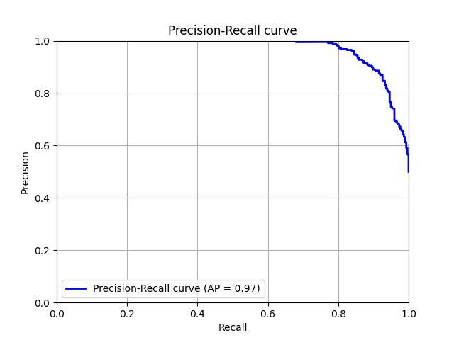

# Airbus Helicopter Accelerometer

## Introduction

The objective of this project is to leverage the Airbus Helicopter Accelerometer Dataset to develop an unsupervised anomaly detection model using a convolutional autoencoder. This autoencoder is trained to reconstruct accelerometer signals from a dataset containing only normal behavior recordings. After training, the model is used to detect anomalies in a validation dataset by identifying discrepancies in signal reconstruction.

In this approach, input data is transformed into 64x64 STFT spectrogram patches, with the y-axis representing frequencies in the Fourier domain and the x-axis representing a temporal window. This spectrogram-based representation, inspired by insights from this paper ([Rodriguez2020](https://web3.arxiv.org/pdf/2005.07031v1)), serves as a strong baseline. Interestingly, the paper showed suboptimal results for spectrogram input, which motivated further exploration here.

## Installation

### Environment

Create the env:

```bash
cd <PATH_TO_airbus>
mkvirtualenv airbus -p python3.11
python -m pip install --upgrade pip
pip install -r requirements.txt
```

### Dataset generation

To generate the input data in the appropriate format for the training we just need to run the script process.py with the desired parameters that also allows further exploration of hyper-parameters.

``` bash
cd data
./process.py --dir_out "~/MyTmp/AirbusHelicopterAccelerometer/data-db" n_fft 127 --win_length 126 --hop_length 8
```

### Training the model in the train set (no anomalous samples)

To reproduce results:

1. Set PYTHONPATH.
``` bash
export PYTHONPATH=.
```

2. Set the GPUs for multi-GPU training.
``` bash
export CUDA_VISIBLE_DEVICES=0,1  # define the GPU ids you want to use.
```

3. Run the training script `cli/a1_train.py` using the provided configuration file. Execute the following command:
``` bash
./cli/a1_train.py <cfg_fn> <encoder_name> <augmenation_degree>
./cli/a1_train.py cfg/train-adam-w.yaml autoencoder_v1 0.1
```

The training algorithm supports mix-precision training that can be specified in the configuration file among other hyper-parameters.


### Evaluate the model in the validation set
Run the training script `cli/a2_eval.py` using the provided configuration file. Execute the following command:
``` bash
export PYTHONPATH=.
export CUDA_VISIBLE_DEVICES=0
./cli/a2_eval.py <cfg_fn> <encoder_name> <n_feat>
./cli/a2_eval.py cfg/valid.yaml autoencoder_v1 --percentile 0.0015
```

### Results and Discussions
* The best model achieved an AUC (TPR-FPR) of 0.96, surpassing the highest AUC of 0.92 reported in the baseline study [Rodriguez2020](https://web3.arxiv.org/pdf/2005.07031v1), achieved by model SC.
* Models trained with the raw spectrogram in dB as input produced significantly poorer results compared to those trained with a frequency-weighted spectrogram. Notably, a quadratic weight decay in frequency yielded the best performance.
* Furthermore, the True Positive Rate (TPR) has shown improvement within low False Positive Rate (FPR) ranges, enhancing the model’s suitability for detecting anomalous engine behavior at low FPR.
* With an FPR fixed at 0.01, the model achieves a TPR of 0.78, slightly below the 0.85 TPR reported in [Rodriguez2020](https://web3.arxiv.org/pdf/2005.07031v1) for model SC, suggesting further gains may be possible with additional STFT parameter optimization.
* Setting the FPR to 0.05 yields a TPR of 0.85, matching the SC model's performance at this TPR, though the corresponding FPR was reported at 0.01 in the baseline.

Following the README and using the `cfg/train-adam-w.yaml` training configuration we can obtain the following results:




#### Future potential optimization
* **Spectrogram weighting**: Initial tests reveal that how the spectrogram is weighted significantly affects model performance, suggesting that testing alternative weighting strategies may yield further improvements.
* **Spectrogram parameters**: Automating the search for optimal Fourier frequencies, hop length, and Hanning window length could also enhance model performance.
* **Reconstruction error transformation**: The method for converting the 2D reconstruction error matrix into a single error score has a non-negligible impact on results. Exploring thresholds, masking, and averaging techniques carefully on a dedicated validation-test split, could improve robustness.
* **Classification model**: Testing a classification model trained on validation data, as suggested in this [Coursera resource](https://coursera-assessments.s3.amazonaws.com/assessments/1680037725362/cedf03c2-655d-4c96-9f23-e2e9f96c6654/Helicopter%20Vibrations%20Anomaly%20Detection.pdf), may further clarify anomaly detection capabilities. For example, using a decision tree approach, such as a `LightGBM` forest, could highlight feature importance. Based on these insights, it may be possible to refine the weighting function to go beyond the current linear or quadratic frequency weighting, potentially improving anomaly detection.
