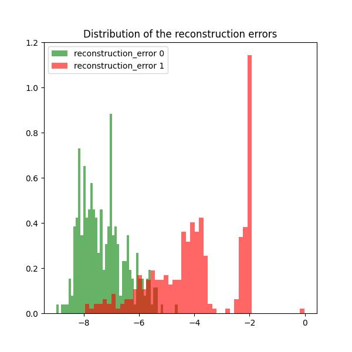

# Airbus Helicopter Accelerometer

## Introduction

The objective of this project is to leverage the Airbus Helicopter Accelerometer Dataset to develop an unsupervised anomaly detection model using a convolutional autoencoder. This autoencoder is trained to reconstruct accelerometer signals from a dataset containing only normal behavior recordings. After training, the model is used to detect anomalies in a validation dataset by identifying discrepancies in signal reconstruction.

In this approach, input data is transformed into 64x64 STFT spectrogram patches, with the y-axis representing frequencies in the Fourier domain and the x-axis representing a temporal window. This spectrogram-based representation, inspired by insights from this paper ([https://web3.arxiv.org/pdf/2005.07031v1](https://web3.arxiv.org/pdf/2005.07031v1)), serves as a strong baseline. Interestingly, the paper showed suboptimal results for spectrogram input, which motivated further exploration here.

## Installation

### Environment

Create the env:

```bash
cd <PATH_TO_airbus>
mkvirtualenv airbus -p python3.11
python -m pip install --upgrade pip
pip install -r requirements.txt
```

### Dataset generation
``` bash
cd data
./process.py --dir_out <dir_out> ...
```

### Training the model in the train set (no anomalous samples)

To reproduce results:

0. Tmux Session
``` bash
tmux a -t train   # or tmux new -s train
```

1. Set PYTHONPATH and GPUs
``` bash
export PYTHONPATH=.
export CUDA_VISIBLE_DEVICES=0,1
```

2. Run the training script `cli/a1_train.py` using the provided configuration file. Execute the following command:
``` bash
./cli/a1_train.py <cfg_fn> <encoder_name> <augmenation_degree>
./cli/a1_train.py cfg/train-adam-var.yaml autoencoder_v1 0.1
```

### Evaluate the model in the validation set
Run the training script `cli/a2_eval.py` using the provided configuration file. Execute the following command:
``` bash
export PYTHONPATH=.
export CUDA_VISIBLE_DEVICES=0
./cli/a2_eval.py <cfg_fn> <encoder_name> <n_feat>
./cli/a2_eval.py cfg/valid.yaml autoencoder_v1 64
```

### Results
* The best model achieved an AUC (TPr-FPr) of 0.95, surpassing the SC model’s best AUC of 0.92 reported in the baseline paper.
* Additionally, the True Positive Rate (TPR) has improved within low False Positive Rate (FPR) ranges, enhancing the model's usefulness in detecting anomalous engine behavior.

#### Future potential optimization
* **Spectrogram weighting**: Initial tests reveal that how the spectrogram is weighted significantly affects model performance, suggesting that testing alternative weighting strategies may yield further improvements.
* **Reconstruction error transformation**: The method for converting the 2D reconstruction error matrix into a single error score has a strong impact on results. Exploring thresholds, masking, and averaging techniques carefully on a dedicated validation-test split, could improve robustness.
* **Spectrogram parameters**: Automating the search for optimal Fourier frequencies, hop length, and Hanning window length could also enhance model performance.
* **Classification model**: Testing a classification model trained on validation data, as suggested in this [Coursera resource](https://coursera-assessments.s3.amazonaws.com/assessments/1680037725362/cedf03c2-655d-4c96-9f23-e2e9f96c6654/Helicopter%20Vibrations%20Anomaly%20Detection.pdf), may further clarify anomaly detection capabilities. However, ensuring data integrity by avoiding direct use of the validation set for training is essential to avoid overfitting, but in the link I only saw the validation set being used.

Following the README and using the `cfg/train-adam-w.yaml` training configuration we can obtain the following results:




